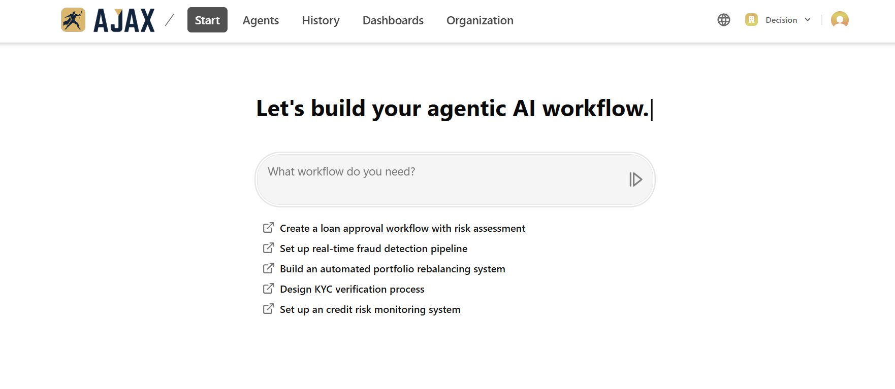

# Ajax - AI-Powered Financial Workflow Builder

[](https://www.typescriptlang.org/)
[](https://nextjs.org/)
[](https://reactjs.org/)
[](https://tailwindcss.com/)
[](https://opensource.org/licenses/Apache-2.0)

Ajax is a cutting-edge AI-powered platform that enables users to build, deploy, and manage sophisticated financial agentic workflows. With support for multiple AI providers and an intuitive chat-based interface, Ajax transforms complex financial processes into intelligent, automated workflows.

## 📸 Screenshots

<div align="center">
  
  <p><em>Ajax AI Workflow Builder - Main Dashboard Interface</em></p>
</div>

## ✨ Features

### 🤖 **Multi-AI Provider Support**
- **OpenAI GPT Models** - Advanced language understanding and generation
- **Anthropic Claude** - Powerful reasoning and analysis capabilities
- **Google Gemini** - Multimodal AI processing
- **Azure OpenAI** - Enterprise-grade AI services
- **Ollama** - Local model deployment support

### 💼 **Financial Workflow Templates**
- **Credit Risk Analysis** - Automated risk assessment and scoring
- **Investment Management** - Portfolio optimization and rebalancing
- **Stock Research** - Market analysis and investment insights
- **Business Intelligence** - Data-driven financial reporting
- **KYC Verification** - Automated compliance and document validation
- **Fraud Detection** - Real-time transaction monitoring

### 🎯 **Intelligent Agent System**
- **Dynamic Inquiry System** - Context-aware follow-up questions
- **Web Search Integration** - Real-time financial data retrieval
- **Canvas Workflow Builder** - Visual workflow design interface
- **Multi-modal Processing** - Text, image, and video analysis
- **Streaming Responses** - Real-time AI interactions

### 🔐 **Enterprise Security**
- **Clerk Authentication** - Secure user management
- **Redis Session Management** - Scalable data storage
- **Stripe Payment Integration** - Secure billing and subscriptions
- **Sentry Error Monitoring** - Comprehensive error tracking

## 🚀 Quick Start

### Prerequisites

- **Node.js** 18+ (recommended: use [fnm](https://github.com/Schniz/fnm) or [nvm](https://github.com/nvm-sh/nvm))
- **pnpm** 8+ (install via `npm install -g pnpm`)
- **Redis** (for session management)
- **PostgreSQL** (for data persistence)

### Installation

1. **Clone the repository**
   ```bash
   git clone https://github.com/ramin-fazli/ajax-app.git
   cd ajax-app
   ```

2. **Install dependencies**
   ```bash
   pnpm install
   ```

3. **Environment Setup**
   ```bash
   cp .env.example .env.local
   ```

   Configure your environment variables:
   ```env
   # Authentication
   NEXT_PUBLIC_CLERK_PUBLISHABLE_KEY=your_clerk_publishable_key
   CLERK_SECRET_KEY=your_clerk_secret_key

   # AI Providers
   OPENAI_API_KEY=your_openai_api_key
   ANTHROPIC_API_KEY=your_anthropic_api_key
   GOOGLE_GENERATIVE_AI_API_KEY=your_google_ai_key
   AZURE_OPENAI_API_KEY=your_azure_openai_key

   # Database
   DATABASE_URL=your_postgresql_url
   REDIS_URL=your_redis_url

   # Payment
   STRIPE_SECRET_KEY=your_stripe_secret_key
   NEXT_PUBLIC_STRIPE_PUBLISHABLE_KEY=your_stripe_publishable_key

   # Monitoring
   SENTRY_DSN=your_sentry_dsn
   ```

4. **Database Setup**
   ```bash
   pnpm db:migrate
   ```

5. **Start Development Server**
   ```bash
   pnpm dev
   ```

   The application will be available at `http://localhost:3000`

## 🏗️ Architecture

### Tech Stack

- **Frontend**: Next.js 14 with App Router, React 18, TypeScript
- **UI Components**: Radix UI, Tailwind CSS, Lucide Icons
- **AI Integration**: Vercel AI SDK with multi-provider support
- **State Management**: AI RSC (React Server Components)
- **Database**: PostgreSQL with Drizzle ORM
- **Cache**: Redis for session and chat storage
- **Authentication**: Clerk
- **Payments**: Stripe
- **Monitoring**: Sentry
- **Testing**: Vitest, Playwright
- **Deployment**: Vercel

### Project Structure

```
src/
├── app/                    # Next.js App Router pages
│   └── [locale]/          # Internationalized routes
├── chat-components/       # AI chat interface components
├── components/            # Reusable UI components
├── features/             # Feature-specific components
│   ├── auth/            # Authentication features
│   ├── billing/         # Payment and subscription
│   ├── dashboard/       # User dashboard
│   └── landing/         # Marketing pages
├── lib/                 # Core utilities and configurations
│   ├── agents/         # AI agent implementations
│   ├── actions/        # Server actions
│   ├── hooks/          # Custom React hooks
│   ├── schema/         # Data validation schemas
│   └── utils/          # Utility functions
├── locales/            # Internationalization files
└── styles/             # Global CSS styles
```

## 🎮 Usage

### Building Your First Workflow

1. **Start a New Chat**
   - Navigate to the dashboard and click "New Workflow"
   - Describe your financial workflow needs in natural language

2. **Select a Template**
   - Ajax will suggest appropriate workflow templates
   - Choose from pre-built templates or request custom workflows

3. **Configure Parameters**
   - Answer guided questions to customize your workflow
   - Specify data sources, risk parameters, and output requirements

4. **Deploy & Monitor**
   - Review the generated workflow in the canvas view
   - Deploy to production and monitor performance

### Example Workflows

```typescript
// Credit Risk Assessment
// Create a loan approval workflow that analyzes credit scores,
// income verification, and debt-to-income ratios with automated
// decision making based on configurable risk thresholds.

// Portfolio Rebalancing
// Build an automated portfolio rebalancing system that monitors
// asset allocation, triggers rebalancing based on drift thresholds,
// and executes trades while maintaining risk constraints.

// Fraud Detection
// Design a real-time fraud detection pipeline that analyzes
// transaction patterns, flags suspicious activities, and
// integrates with compliance reporting systems.
```

## 🧪 Testing

```bash
# Run unit tests
pnpm test

# Run E2E tests
pnpm test:e2e

# Type checking
pnpm check-types

# Linting
pnpm lint
```

## 📦 Deployment

### Vercel (Recommended)

1. **Connect your repository** to Vercel
2. **Configure environment variables** in the Vercel dashboard
3. **Deploy** - Vercel will automatically build and deploy your application

### Docker

```bash
# Build the image
docker build -t ajax-app .

# Run the container
docker run -p 3000:3000 ajax-app
```

### Environment-specific Commands

```bash
# Production build
pnpm build

# Start production server
pnpm start

# Database migrations (production)
pnpm db:migrate
```

## 🔧 Configuration

### AI Model Configuration

Configure available AI models in `src/lib/types/models.ts`:

```typescript
export const models = [
  {
    id: 'gpt-4o',
    name: 'GPT-4 Omni',
    provider: 'openai',
    description: 'Most capable GPT-4 model'
  },
  {
    id: 'claude-3-5-sonnet-20241022',
    name: 'Claude 3.5 Sonnet',
    provider: 'anthropic',
    description: 'Anthropic\'s most intelligent model'
  }
  // Add more models...
];
```

### Workflow Templates

Extend workflow templates in `src/lib/agents/agent-creator.tsx`:

```typescript
const templates = [
  'Credit Risk Analysis Template',
  'Financial Analysis Template',
  'Investment Management Template',
  'Stock Research Template',
  'Business Intelligence Template'
  // Add custom templates...
];
```

## 🤝 Contributing

We welcome contributions! Please follow these steps:

1. **Fork the repository**
2. **Create a feature branch**: `git checkout -b feature/amazing-feature`
3. **Commit your changes**: `git commit -m 'Add amazing feature'`
4. **Push to the branch**: `git push origin feature/amazing-feature`
5. **Open a Pull Request**

### Development Guidelines

- Follow TypeScript best practices
- Maintain test coverage above 80%
- Use conventional commits
- Update documentation for new features
- Ensure accessibility compliance (WCAG 2.1)

## 📊 Performance

- **Lighthouse Score**: 95+ (Performance, Accessibility, Best Practices, SEO)
- **Core Web Vitals**: Optimized for excellent user experience
- **Bundle Size**: Optimized with dynamic imports and tree shaking
- **Caching**: Aggressive caching strategy with Redis and CDN

## 🌍 Internationalization

Ajax supports multiple languages:

- **English** (en) - Primary language
- **French** (fr) - Français

Add new languages by creating translation files in `src/locales/`.

## 📈 Monitoring & Analytics

- **Error Tracking**: Sentry integration for real-time error monitoring
- **Performance Monitoring**: Built-in Next.js analytics
- **User Analytics**: Privacy-focused usage tracking
- **AI Usage Metrics**: Track AI model usage and costs

## 🛡️ Security

- **Authentication**: Secure user authentication with Clerk
- **Authorization**: Role-based access control
- **Data Encryption**: End-to-end encryption for sensitive data
- **API Security**: Rate limiting and input validation
- **Compliance**: SOC 2 Type II, GDPR compliant

## 📄 License

This project is licensed under the Apache License 2.0 - see the [LICENSE](LICENSE) file for details.

```
Copyright 2024 Ajax AI

Licensed under the Apache License, Version 2.0 (the "License");
you may not use this file except in compliance with the License.
You may obtain a copy of the License at

    http://www.apache.org/licenses/LICENSE-2.0

Unless required by applicable law or agreed to in writing, software
distributed under the License is distributed on an "AS IS" BASIS,
WITHOUT WARRANTIES OR CONDITIONS OF ANY KIND, either express or implied.
See the License for the specific language governing permissions and
limitations under the License.
```

## 🆘 Support

- **Issues**: [GitHub Issues](https://github.com/ramin-fazli/ajax-app/issues)

## 🙏 Acknowledgments

- [Vercel](https://vercel.com) for the AI SDK and hosting platform
- [OpenAI](https://openai.com), [Anthropic](https://anthropic.com), and [Google](https://ai.google.dev) for AI model access
- [Radix UI](https://radix-ui.com) for accessible component primitives
- [Tailwind CSS](https://tailwindcss.com) for the utility-first CSS framework
- [Clerk](https://clerk.com) for authentication infrastructure

---
